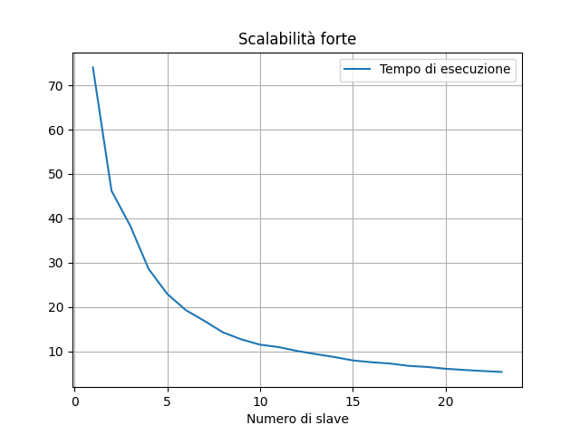
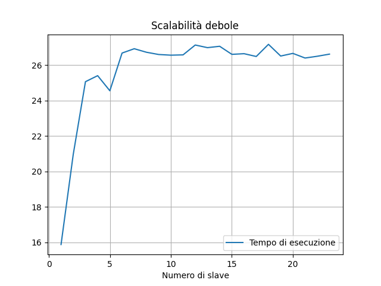

# :orange_book: Word Count

<div id="top"></div>

[![MIT License][license-shield]][license-url]

<!-- TABELLA DEI CONTENUTI -->
<details open>
  <summary>Tabella dei contenuti</summary>
  <ol>
    <li>
      <a href="#introduzione-al-problema">Introduzione al problema</a>
    </li>
    <li>
      <a href="#definizione-della-soluzione">Definizione della soluzione</a>
      <ul>
        <li>
          <a href="#divisione-in-base-al-numero-totale-di-byte">Divisione in base al numero totale di byte</a>
        </li>
        <li>
          <a href="#soluzione-ad-alto-livello">Soluzione ad alto livello</a>
        </li>
      </ul>
    </li>
    <li>
      <a href="#esecuzione">Esecuzione</a>
      <ul>
        <li>
          <a href="#requisiti">Requisiti</a>
        </li>
        <li>
          <a href="#installazione">Installazione</a>
        </li>
        <li>
          <a href="#modalità-di-utilizzo">Modalità di utilizzo</a>
        </li>
      </ul>
    <li>
      <a href="#struttura-del-progetto">Struttura del progetto</a>
    </li>
    <li>
      <a href="#implementazione">Implementazione</a>
      <ul>
        <li>
          <a href="#controllo-dellinput">Controllo dell'input</a>
        </li>
        <li>
          <a href="#calcolo-dei-byte-totali">Calcolo dei byte totali</a>
        </li>
        <li>
          <a href="#divisione-delle-porzioni-di-file">Divisione delle porzioni di file</a>
          <ul>
            <li>
              <a href="#invio-file-agli-slave">Invio file agli slave</a>
            </li>
            <li>
              <a href="#ricezione-dei-file-dal-master">Ricezione dei file dal master</a>
            </li>
          </ul>
        </li>
        <li>
          <a href="#conteggio-delle-parole">Conteggio delle parole</a>
        </li>
        <li>
          <a href="#unione-degli-istogrammi-locali">Unione degli istogrammi locali</a>
          <ul>
            <li>
              <a href="#invio-degli-istogrammi-locali">Invio degli istogrammi locali</a>
            </li>
            <li>
              <a href="#ricezione-degli-istogrammi-locali">Ricezione degli istogrammi locali</a>
            </li>
          </ul>
        </li>
        <li>
          <a href="#ordinamento-e-creazione-del-file-csv">Ordinamento e creazione del file csv</a>
        </li>
      </ul>
    </li>
    <li>
      <a href="#correttezza">Correttezza</a>
    <li>
      <a href="#benchmark">Benchmark</a>
      <ul>
        <li>
          <a href="#scalabilità-forte">Scalabilità forte</a>
        </li>
        <li>
          <a href="#scalabilità-debole">Scalabilità debole</a>
        </li>
      </ul>
    </li>
    <li>
      <a href="#conclusioni">Conclusioni</a>
    </li>
  </ol>
</details>

<!-- INTRODUZIONE AL PROBLEMA -->
## Introduzione al problema

In molti contesti è necessario rispettare dei vincoli legati al numero di parole utilizzate all'interno dei documenti. Per questo motivo, vengono utilizzati programmi per mantenere traccia del numero di occorrenze di ogni parola. Negli ultimi anni, l'aumento della mole di dati ha spinto la ricerca in soluzioni sempre più efficienti per effettuare tale operazione. Grazie allo sviluppo tecnologico, una delle possibili strade è quella di creare alternative che sfruttino il concetto di parallelismo. A tal proposito, questo progetto propone una soluzione implementata tramite l'utilizzo di MPI.

<p align="right">(<a href="#top">torna su</a>)</p>

<!-- DEFINIZIONE DELLA SOLUZIONE -->
## Definizione della soluzione

Uno degli obiettivi fondamentali del progetto è quello di massimizzare lo speed-up. Al fine di raggiungere tale obiettivo è necessario definire una soluzione efficiente per la distribuzione equa del carico di lavoro. In questo contesto, ciò equivale a distribuire in modo uniforme i file da leggere sui diversi processi.

Un approccio immediato potrebbe essere quello di distribuire il numero di file per i processi a disposizione. Questa soluzione, per quanto semplice, risulta essere poco efficiente per due motivi:
* il numero di processi potrebbe essere superiore rispetto al numero di file da leggere;
* le dimensioni dei file potrebbero differire anche di diversi ordini di grandezza.

Adottare questa soluzione porterebbe:
* nel primo caso, ad utilizzare solo un sottoinsieme dei processi a disposizione;
* nel secondo caso, ad una limitazione dello speed-up; la presenza di file molto più grandi rispetto ad altri implicherebbe tempi di esecuzione più lunghi per alcuni processi.

La seconda motivazione apre le porte a quella che è una soluzione molto più efficiente di quella immediata: invece di dividere il numero dei file per i processi a disposizione, è possibile dividere il carico di lavoro in base al numero totale di byte da leggere.

### Divisione in base al numero totale di byte

In questa sezione si formalizza la strategia utilizzata per distribuire il lavoro tra i vari processi.

In un primo momento viene calcolato il numero totale di byte. In seguito lo si divide per il numero di processi a disposizione, in modo da ottenere la quantità di byte destinata ad ognuno di essi. Potrebbe accadere, però, che il numero di processi non sia un multiplo del numero totale di byte. Questo comporterebbe una mancata distribuzione degli ultimi `rest` byte da leggere, dove `rest` è proprio il resto della divisione. Banalmente, si potrebbe pensare di assegnare la lettura di questi ultimi `rest` byte ad un unico processo. Tuttavia, una strategia più efficiente risulta essere quella di incaricare i primi `rest` processi di leggere un byte in più, in modo da non sovraccaricare l'utilizzo di un processo rispetto ad un altro.

Quindi, siano p<sub>1</sub>, p<sub>2</sub>, ..., p<sub>n</sub> i processi a disposizione e siano `size` e `rest` relativamente il risultato e il resto della divisione tra il numero totale di byte e il numero di processi, diremo che il processo p<sub>i</sub> sarà incaricato di leggere: 
* `size + 1` byte, se `i` è minore o uguale di `rest`;
* `size` byte, altrimenti. 

### Soluzione ad alto livello

La soluzione è stata implementata tramite l'utilizzo di un'architettura **master-slaves**. In base al ruolo del processo all'interno dell'architettura è possibile dividere la soluzione in diverse fasi.

Il processo **master** si occupa di:
* controllare l'input del programma; 
* calcolare il numero totale di byte dei file;
* inviare le porzioni di file da leggere agli **slave**;
* ricevere gli istogrammi locali dagli **slave**;
* unire i risultati ricevuti in un unico istrogramma;
* ordinare l'istrogramma in ordine decrescente in base al numero di occorrenze;
* creare un file csv con le parole e le relative occorrenze.

I processi **slave** si occupano di:
* ricevere le porzioni di file da leggere;
* contare le occorrenze delle diverse parole all'interno dei file;
* inviare l'istogramma locale al **master**.

<p align="right">(<a href="#top">torna su</a>)</p>

## Esecuzione

In questa sezione vengono descritte tutte le operazioni necessarie per poter eseguire il programma.

### Requisiti

* Docker

### Installazione

Avviare docker all'interno della directory principale del progetto tramite il comando seguente:

* Ubuntu e OSX:
  ``` sh
  docker run -it --mount src="$(pwd)",target=/home type=bind spagnuolocarmine/docker-mpi:latest
  ```
* Windows: 
  ``` sh
  docker run -it --mount src="%cd%",target=/home,type=bind spagnuolocarmine/docker-mpi:latest
  ```
  
Una volta avviato il container, all'interno della directory `home`, eseguire lo script `install.sh`.

``` sh
cd home

chmod +x install.sh
./install.sh
```

Terminata l'installazione compilare il progetto tramite il comando:

``` sh
make main 
```

### Modalità di utilizzo

È possibile utilizzare due tipologie di input differenti per il programma:
* lista di files da contare, tramite il flag `-f`;
  ``` sh
  mpirun --mca btl_vader_single_copy_mechanism none -np <numero di processi> --allow-run-as-root ./word-count -f <path dei files>
  ```
* directory da contare, flag `-d`.
  ``` sh
  mpirun --mca btl_vader_single_copy_mechanism none -np <numero di processi> --allow-run-as-root ./word-count -d <path della directory>
  ```

Inoltre, è possibile utilizzare il flag aggiuntivo `-log` per ottenere i log dell'esecuzione.
``` sh
mpirun --mca btl_vader_single_copy_mechanism none -np <numero di processi> --allow-run-as-root ./word-count -log ...
```

<p align="right">(<a href="#top">torna su</a>)</p>

## Struttura del progetto

```
.
├── benchmark
│   ├── images
│   │   ├── strong-scalability.png
│   │   ├── weak-scalability.png
│   ├── hfile
│   ├── strong-scalability.sh
│   ├── weak-scalability.sh
│   ├── word-count.c
├── include
│   ├── file.h
│   ├── input.h
│   ├── log.h
│   ├── my-mpi.h
│   ├── sort.h
├── lib
│   ├── file.c
│   ├── input.c
│   ├── log.c
│   ├── my-mpi.c
│   ├── sort.c
├── src
│   ├── word-count.h
├── test
│   ├── test.sh
│   ├── word-count.csv
├── test_files
│   ├── sub_folder
│   │   ├── list1.txt
│   │   ├── list2.txt
│   │   ├── list3.txt
│   │   ├── list4.txt
│   ├── empty.txt
│   ├── list1.txt
├── install.sh
├── LICENSE
├── Makefile
├── README.md
```

<p align="right">(<a href="#top">torna su</a>)</p>

## Implementazione

In questa sezione viene descritta l'implementazione relativa ad ogni fase della soluzione. Alcuni dei listati riportati di seguito non sono completi in quanto l'obiettivo principale è quello di mostrare solo le parti fondamentali.

Come supporto per l'implementazione è stata utilizzata la libreria [glib.h](https://docs.gtk.org/glib/), in particolare sono state utilizzate le seguenti strutture dati:
* `GList`: definisce una struttura di tipo lista utilizzata per la memorizzazione dinamica delle informazioni relative ai file;
* `GHashTable`: implementazione di un hash table per la creazione degli istogrammi;
* `GHashTableIter`: utilizzata per poter iterare le coppie (lessema, occorrenze) memorizzate all'interno dell'hash table.

### Controllo dell'input

L'operazione di controllo dell'input avviene tramite la funzione `check_input()` della libreria `input.h`. La funzione esegue semplicemente dei controlli sugli argomenti passati in input.

### Calcolo dei byte totali

L'operazione di lettura dei file e di calcolo dei byte totali è stata implementata tramite la funzione `read_files()`, anch'essa della libreria `input.h`. Quest'ultima, come mostrato nel listato successivo, prende in input:
* un riferimento ad una variabie di tipo `GList` la quale, al termine dell'esecuzione della funzione, conterrà la lista di file letti;
* un riferimento ad una variabile di tipo `off_t` che conterrà il numero totale di byte letti.

``` c
GList *file_list;
off_t total_bytes = 0;

read_files(..., &file_list, &total_bytes);
```

All'interno della lista, le informazioni relative ai file vengono memorizzate tramite il tipo `File`, definito all'interno della libreria `file.h` come segue:

``` c
#define MAX_PATH_LEN 256

typedef struct file {

    char path_file[MAX_PATH_LEN];
    off_t bytes_size;
    long start_offset;
    long end_offset;

} File;
```

La definizione di questa struttura permette la memorizzazione del path assoluto e dimensione di ogni file. I parametri `start_offset` e `end_offset` vengono inizializzati successivamente dal processo master per definire la parte di file da delegare ad ogni processo.

### Divisione delle porzioni di file

In questa fase si definiscono le porzioni di file da leggere da parte dei vari slave. Il seguente listato mostra quali operazioni vengono effettuate dai diversi processi.

``` c
File *files;
guint n_files;          

MPI_Datatype file_type = create_file_type();

if (rank == MASTER) {

    send_files_to_slaves(size, file_list, total_bytes, file_type);

} else {

    recv_files_from_master(&n_files, &files, file_type);

}

MPI_Type_free(&file_type);
```

Le prime operazioni di questa fase comprendono la dichiarazione di:

* un buffer di tipo `File` utilizzato dagli slave per ricevere le informazioni relative ai file da leggere;
* una variabile di tipo `guint` (alias `unsigned int`) per memorizzare il numero di file contenuti all'interno del buffer `File`.

Successivamente viene eseguita la funzione `create_file_type()`, della libreria `my-mpi.h`, da parte di tutti i processi. Quest'ultima viene utilizzata per la creazione del tipo derivato `File` in modo da permettere ai processi di ricevere e inviare dati di questo tipo. Il risultato di questa funzione viene memorizzato all'interno della variabile `file_type` di tipo `MPI_Datatype`.

Una volta creato il tipo `File`, i processi eseguono una funzione diversa in base al loro ruolo all'interno dell'architettura:
* master esegue la funzione `send_files_to_slaves()`;
* gli slave eseguono la funzione `recv_files_from_master()`.

Entrambe le funzioni sono state implementate all'interno della libreria `my-mpi.h`.

Terminato l'invio e la ricezione delle informazioni, viene eseguita la funzione `MPI_Type_free()` da parte di tutti i processi in modo da eliminare il tipo `file_type`. 

#### Invio file agli slave

La funzione `send_files_to_slaves()`, come suggerisce il nome, viene utilizzata dal master per comunicare ad ogni slave le porzioni di file da leggere.  
Le prime operazioni sono relative al calcolo del risultato e del resto fra il numero totale di byte e il numero di slave.

``` c
int n_slaves = size - 1;

off_t bytes_for_each_processes = total_bytes / n_slaves;
off_t rest = total_bytes % n_slaves;
```

Tramite l'utilizzo della funzione `g_list_length()` viene memorizzato all'interno della variabile `n_files` il numero di file ricevuti in input. 

``` c
guint n_files = g_list_length(file_list);
```

Poiché le varie porzioni da destinare ad ogni processo vengono calcolate volta per volta, la comunicazione fra il processo master e gli slave avviene tramite una comunicazione non-bloccante. Questo permette al master di continuare a dividere i file tra i vari processi e contemporaneamente inizializzare la comunicazione verso il processo sul quale sono state appena calcolate le porzioni da leggere.  
L'utilizzo della comunicazione non-bloccante richiede che il buffer utillizzato all'interno della stessa non venga in nessun modo modificato fin quando la comunicazione non viene completata. Per questo motivo, viene dichiarata una matrice di tipo `File` di dimensione `n_slaves x n_files`, dove la riga `i` rappresenta il buffer utilizzato dal master per inviare i dati all'i-esimo slave. 
Inoltre, viene dichiarato anche un array di tipo `MPI_Request` di dimensione `n_slaves` utilizzato per la memorizzazione delle richieste relative ad ogni comunicazione. Quest'ultimo sarà necessario per attendere il completamento di tutte le comunicazioni inizializzate.

``` c
File files[n_slaves][n_files];

MPI_Request requests[n_slaves];
```

Il prossimo passo consiste nel calcolare, per ogni processo, il numero di byte da inviare. Una volta fatto ciò, finché il numero di byte da inviare è maggiore di zero, vengono effettuate le seguenti operazioni:
1. Copia della struttura `File` attualmente puntata all'interno della lista;
2. Calcolo del numero di byte non distribuiti del file attuale;
3. Inizializzazione dei campi `start_offset` ed `end_offset`;
4. Copia della struttura appena modificata all'interno del buffer `files`;
5. Aggiornamento del numero di byte ancora da inviare al processo corrente;
6. Se il file attuale non ha più byte rimanenti da distribuire:
    * viene aggiornato il puntatore della lista al file successivo e si torna al passo 1;
    * altrimenti, si memorizza il valore relativo all'ultimo offset letto del file attuale e si passa alla distribuzione dei file per il processo successivo.

``` c
for (int i_slave = 0; i_slave < n_slaves; i_slave++) {

  off_t total_bytes_to_send = bytes_for_each_processes;
  if (rest > 0) {
    total_bytes_to_send++;
    rest--;
  }

  while (total_bytes_to_send > 0) { ... }
```

Una volta terminata la partizione dei file relativa al processo corrente, tramite la funzione `MPI_Isend()`, viene inizializzata la comunicazione dei file verso quest'ultimo.

```c
MPI_Isend(&files[i_slave][0], n_files,
  file_type, i_slave + 1, TAG_NUM_FILES,
  MPI_COMM_WORLD, &requests[i_slave]);

}
```

Infine, una volta terminata la partizione per tutti i processi, tramite la funzione `MPI_Waitall()` vengono completate tutte le comunicazioni precedentemente inizializzate.

``` c
MPI_Waitall(n_slaves, requests, MPI_STATUS_IGNORE);
```

#### Ricezione dei file dal master

La funzione `recv_files_from_master()` prende in input il riferimento ad una variabile di tipo `guint` (`n_files`) e un riferimento ad un puntatore di tipo `File` (`files`). La funzione viene utilizzata per:

* ricevere le porzioni di file da leggere inviate dal master;
* memorizzare il numero di file e i file nelle due variabili passate in input alla funzione. 

Tramite la funzione `MPI_Probe()` il processo rimane in attesa fin quando non arriva un messaggio, senza però riceverlo effettivamente. Questo permette al processo di ottenere informazioni sul messaggio in arrivo. In questo caso, la funzione viene utilizzata per ottenere il numero di file contenuti all'interno del messaggio, in modo da permettere al destinatario di allocare correttamente il buffer per la ricezione di quest'ultimo. 

``` c
MPI_Status status;
MPI_Probe(MASTER, TAG_NUM_FILES, 
  MPI_COMM_WORLD, &status);
```

Tramite la funzione `MPI_Get_count()` viene memorizzato all'interno della variabile `n_files` il numero di file contenuti all'interno del messaggio. Successivamente, viene allocata dinamicamente la memoria relativa al buffer utilizzato per la ricezione.

``` c
MPI_Get_count(&status, file_type, n_files);

*files = malloc((sizeof **files) * *n_files);
```
Allocata la memoria, viene eseguita la funzione `MPI_Recv()` in modo da ricevere effettivamente il messaggio.

``` c
MPI_Recv(*files, *n_files, file_type, MASTER, 
  TAG_NUM_FILES, MPI_COMM_WORLD,
  MPI_STATUS_IGNORE);
```

### Conteggio delle parole

Ricevute le porzioni di file da leggere da parte del master, gli slave iniziano la fase di conteggio delle parole. Risulta necessario definire una politica di conteggio per prevenire errori dovuti alla partizione dei file in base al numero di byte. I vari slave ricevono come informazione per ogni file il path relativo a quest'ultimo e l'offset iniziale e finale di lettura. A questo punto è possibile trovarsi in due casi:
* l'offset iniziale ha valore pari a zero;
* l'offset iniziale è diverso da zero.

Nel primo caso il processo inizia a leggere il file dall'inizio mentre nel secondo inizia a leggere subito dopo l'ultimo byte letto dal processo precedente. Questa strategia potrebbe in qualche modo troncare la lettura di una parola su processi differenti, causando la lettura di quest'ultima in modo errato. Per prevenire questo problema risulta necessario definire una politica comune a tutti i processi:
* se il processo inizia a leggere dall'offset zero allora quest'ultimo conterà tutte le parole all'interno della sua porzione di file. Inoltre, se l'ultimo byte letto è un carattere, il processo continua a leggere il file fin quando non termina la lettura della parola attuale;
* se il processo inizia a leggere da un offset diverso da zero, quest'ultimo controlla se l'offset attuale coincide con l'inizio di una parola, altrimenti salta tutti i byte iniziali fino all'inizio della parola successiva.

L'utilizzo di questa politica permette di gestire il conteggio relativo alle parole troncate dalla divisione dei file in base al numero totale di byte. In questo modo, il processo corrente continuerà a leggere il file fin quando l'ultima parola non termina, mentre il processo successivo la ignorerà.

Poiché l'obiettivo di questa fase è contare il numero di occorrenze per ogni lessema, risulta necessario controllare ad ogni lettura se la parola appena letta è stata già contata in precedenza oppure no. Per questo motivo, per rendere l'operazione di ricerca più efficiente, è stata utilizzata un'hash-table. Grazie a quest'ultima è possibile controllare in tempo costante se la parola attuale è già presente all'interno di essa oppure no.

Ogni slave esegue la funzione `count_words()`, implementata all'interno della libreria `file.h`, per ogni file ricevuto dal master. Quest'ultima utilizza la politica precedentemente descritta per contare le parole all'interno del file.

``` c
GHashTable *hash_table;

if (rank != MASTER) {

  hash_table = g_hash_table_new(g_str_hash, g_str_equal);

  for (int i = 0; i < n_files; i++) {
  
    File file = files[i];
    count_words(&hash_table, file.path_file, 
      file.start_offset, file.end_offset);
  
  }

}
```
### Unione degli istogrammi locali

In questa fase gli slave comunicano il loro istogramma locale al master in modo da creare un unico risultato. Per poter comunicare le coppie (lessema, occorrenze) memorizzate all'interno dell'hash-table locale di ogni slave viene definita la seguente struttura all'interno della libreria `file.h`.

``` c
#define MAX_WORD_LEN 128

typedef struct word {

    char lexeme[MAX_WORD_LEN];
    unsigned int occurrences;

} Word;
```

Il listato successivo mostra le operazioni effettuate da ogni processo.

``` c
MPI_Datatype word_type = create_word_type();

if (rank == MASTER) {
       
  hash_table = g_hash_table_new(g_str_hash, g_str_equal);

  recv_words_from_slaves(size, &hash_table, word_type);

} else {

  send_words_to_master(hash_table, word_type);

}

MPI_Type_free(&word_type);
```

Come per la fase di invio delle porzioni di file, anche in questa fase viene creato un tipo derivato per l'invio e la ricezione di variabili di tipo `Word` tramite la funzione `create_word_type()`. Il risultato viene memorizzato all'interno della variabile `word_type`.

Successivamente, il processo master esegue la funzione `recv_words_from_slaves()` utilizzata per la ricezione e unione degli istogrammi locali di ogni slave. I risultati vengono memorizzati all'interno della variabile `hash_table`, passata come riferimento alla funzione. Invece, i processi slave eseguono la funzione `send_words_to_master()` per l'invio dell'istogramma locale al processo master.

Una volta terminate le comunicazioni viene eseguita la funzione `MPI_Type_free()` in modo da eliminare il tipo derivato `word_type`.

#### Invio degli istogrammi locali

In questa sezione vengono descritte tutte le fasi per l'invio dell'istogramma locale.

Per poter iterare le varie coppie memorizzate all'interno dell'hash-table viene dichiarata e inizializzata la struttura `GHashTableIter` come segue.

``` c
GHashTableIter hash_table_iter;
g_hash_table_iter_init(&hash_table_iter, hash_table);
```

Successivamente viene memorizzato il numero di parole contenute all'interno dell'hash-table, tramite la funzione `g_hash_table_size()`, all'interno della variabile `n_words`.

``` c
guint n_words = g_hash_table_size(hash_table);
```

Se il numero di parole contate da parte del processo corrente è pari a zero, esso comunica tale valore al processo master e termina la sua esecuzione.

``` c
if (0 == n_words) {
 
  MPI_Send(&n_words, 1, MPI_UNSIGNED, MASTER, 
    TAG_MERGE, MPI_COMM_WORLD);
  
  return ;
  
}
```

Altrimenti, il processo memorizza ogni coppia (lessema, occorrenze) contenuta all'interno dell'hash table all'interno di un buffer di tipo `Word`.

Popolato il buffer quest'ultimo viene inviato al processo master tramite una comunicazione bloccante in quanto non vi sono altre operazioni da eseguire.

``` c
MPI_Send(words, n_words, word_type, MASTER, 
  TAG_MERGE, MPI_COMM_WORLD);
```

#### Ricezione degli istogrammi locali

Il master in questa fase utilizza la funzione `recv_words_from_slaves()` per ricevere gli istogrammi locali da parte degli slave. Di seguito viene riportata l'implementazione di tale funzione.

Per come viene implementato il meccanismo di invio delle varie porzioni di file da leggere, un processo generico `i`, con `i` > 0, inizia il conteggio delle parole sulla sua porzione di file prima di un processo `j`, con `j` > `i`. Questo però non implica che il processo `i` termini la sua esecuzione prima del processo `j`. Per questo motivo, se il master attendesse la ricezione delle parole contate dal primo all'ultimo slave, potrebbe rimanere in attesa (quindi senza effettuare nessuna operazione) dell'istogramma locale relativo al processo corrente, mentre un altro processo potrebbe già aver comunicato il suo istogramma.

Per questo motivo, invece di attendere la ricezione dell'istogramma locale partendo dal primo all'ultimo slave, per ognuno di essi il master esegue la funzione `MPI_Probe()` utilizzando la costante `MPI_ANY_SOURCE`, ottenendo così tutte le informazioni necessarie per ricevere l'istogramma locale relativo al processo che ha già terminato il suo invio.

``` c
int n_slaves = size - 1;

for (int i_slave = 0; i_slave < n_slaves; i_slave++) {

  MPI_Status status;
  MPI_Probe(MPI_ANY_SOURCE, TAG_MERGE, 
    MPI_COMM_WORLD, &status);
```

Come nel caso precedente, tramite la funzione `MPI_Get_count()`, il master alloca lo spazio relativo al buffer utilizzato per la ricezione dell'istogramma locale.
Inoltre, tramite il campo `MPI_SOURCE` relativo alla struttura `MPI_Status`, il master ottiene il rank relativo al processo mittente del messaggio.

``` c
int n_words;
MPI_Get_count(&status, word_type, &n_words);

int source = status.MPI_SOURCE;

Word words[n_words];
```

Se il numero di parole contenute all'interno del messaggio è minore di zero, il master ignora il messaggio e prosegue con la gestione del messaggio successivo.

``` c
if (n_words < 0)
  continue;
```

Altrimenti, tramite la funzione `MPI_Recv()` viene effettivamente ricevuto il messaggio.

``` c
MPI_Recv(words, n_words, word_type, source, 
  TAG_MERGE, MPI_COMM_WORLD, MPI_STATUS_IGNORE);
```

Terminata la ricezione, tutte le coppie (lessema, occorrenze) all'interno del buffer vengono inserite nell'istogramma globale.

Il master riesegue tutte le operazioni fin quando non ha ricevuto gli istogrammi locali di tutti gli slave.

### Ordinamento e creazione del file csv

Le ultime due fasi dell'algoritmo comprendono:
* ordinamento dell'istogramma globale in ordine decrescente in base al numero di occorrenze;
* creazione di un file csv a partire dall'istogramma globale.

Le due operazioni vengono eseguite tramite l'utilizzo delle funzioni:
* `quick_sort()`, della libreria `sort.h`, per l'ordinamento delle coppie;
* `create_csv()`, della libreria `file.h`, per la creazione del file csv.

<p align="right">(<a href="#top">torna su</a>)</p>

## Correttezza

Per provare la correttezza dell'algoritmo è stato utilizzato lo script `test.sh`, contenuto all'interno della cartella `test`. Lo script consiste nell'esecuzione dell'algoritmo con un numero di processi crescente, da 2 a 100. Ad ogni esecuzione viene effettuato un confronto tra il file csv generato dall'algoritmo e un file csv, `test/word-count.csv`, utilizzato come oracolo. I risulati dei vari test vengono memorizzati all'interno del file `test/test.txt`.

Per poter riprodurre i test effettuati è sufficiente eseguire i seguenti comandi:

``` bash
chmod +x ./test/test.sh
./test/test.sh
```

<p align="right">(<a href="#top">torna su</a>)</p>

## Benchmark

In questa sezione vengono riportate le varie misurazioni effettuate in termini di scalabilità forte e scalabilità debole. Le misurazioni sono state effettuate tramite l'utilizzo di un cluster **Google Cloud Platform** composto da 6 macchine di tipo **e2-standard-4**. Ognuna di essa è dotata di 4 vCPUs per un totale di 24 vCPUs disponibili. 

### Scalabilità forte 

La scalabilità forte è stata misurata eseguendo più volte l'algoritmo con un numero di vCPUs crescente, da 2 vCPUs fino a 24 vCPUs. I test sono stati effettuati utilizzando sempre lo stesso input, per una grandezza di byte totali da leggere pari a 513,67 MB.

| Numero di slave | Tempo di esecuzione in secondi | Speed-up |
| :-------------: | :----------------------------: | :------: |
| 1               | 74.031666                      | 1.00     |
| 2               | 46.204213                      | 1.60     |
| 3               | 38.388234                      | 1.93     |
| 4               | 28.560539                      | 2.59     |
| 5               | 22.948686                      | 3.22     |
| 6               | 19.282333                      | 3.84     |
| 7               | 16.855340                      | 4.39     |
| 8               | 14.260683                      | 5.19     |
| 9               | 12.668596                      | 5.84     |
| 10              | 11.485917                      | 6.45     |
| 11              | 10.939283                      | 6.77     |
| 12              | 10.06692                       | 7.35     |
| 13              | 9.352552                       | 7.92     |
| 14              | 8.699361                       | 8.51     |
| 15              | 7.927089                       | 9.34     |
| 16              | 7.526769                       | 9.84     |
| 17              | 7.228280                       | 10.24    |
| 18              | 6.704542                       | 11.04    |
| 19              | 6.459366                       | 11.46    |
| 20              | 6.051065                       | 12.23    |
| 21              | 5.782785                       | 12.80    |
| 22              | 5.539639                       | 13.36    |
| 23              | 5.338991                       | 13.87    |



### Scalabilità debole

Come per la scalabilità forte, la scalabilità debole è stata misurata eseguendo più volte l'algoritmo su un numero di vCPUs differenti. I test sono stati effettuati utilizzando un input di dimensione pari al (numero di slave utilizzati) x 112,37 MB.

| Numero di slave | Tempo di esecuzione in secondi | Dimensione input in MB |
| :-------------: | :----------------------------: | :--------------------: |
| 1               | 15.869725                      | 112,37                 |
| 2               | 20.955662                      | 224.74                 |
| 3               | 25.055182                      | 337.11                 |
| 4               | 25.395312                      | 449.48                 |
| 5               | 24.543799                      | 561.85                 |
| 6               | 26.670880                      | 674.22                 |
| 7               | 26.915306                      | 786.59                 |
| 8               | 26.716327                      | 898.96                 |
| 9               | 26.589688                      | 1011.33                |
| 10              | 26.551581                      | 1123.7                 |
| 11              | 26.568343                      | 1236.07                |
| 13              | 27.124493                      | 1348.44                |
| 13              | 26.975850                      | 1460.81                |
| 14              | 27.053065                      | 1573.18                |
| 15              | 26.598351                      | 1685.55                |
| 16              | 26.635424                      | 1797.92                |
| 17              | 26.477229                      | 1910.29                |
| 18              | 27.163188                      | 2022.66                |
| 19              | 26.503225                      | 2135.03                |
| 20              | 26.652417                      | 2247.4                 |
| 21              | 26.390431                      | 2359.77                |
| 22              | 26.490460                      | 2472.14                |        
| 23              | 26.610655                      | 2584.51                |



<p align="right">(<a href="#top">torna su</a>)</p>

## Conclusioni

L'utilizzo del parallelismo, come evidenziato dai benchmark effettuati, ha portato ad un notevole miglioramento delle prestazioni dell'algoritmo. 

La scalabilità forte ha evidenziato un notevole abbassamento dei tempi di esecuzioni all'aumentare del numero di processi utilizzati. Il vantaggio però, come mostrato all'interno del [grafico](#scalabilità-forte), non segue un andamento costante. Questo è dovuto al fatto che l'aumento del numero di processi implica anche un aumento dell'overhead necessario per effettuare tutte le comunicazioni.

I risultati ottenuti in termini di scalabilità debole hanno dimostrato come, la divisione del lavoro fra i vari processi in base al numero totale di byte, risulta essere una distribuzione equa del carico di lavoro. Infatti, come riportato anche all'interno del [grafico](#scalabilità-debole), i tempi di esecuzione in tutti i casi risultano essere praticamente uguali.

<p align="right">(<a href="#top">torna su</a>)</p> 

<!-- MARKDOWN LINKS & IMAGES -->
[license-shield]: https://img.shields.io/github/license/othneildrew/Best-README-Template.svg?style=for-the-badge
[license-url]: https://github.com/antonio-cirillo/word-count/blob/main/LICENSE
[product-screenshot]: images/screenshot.png